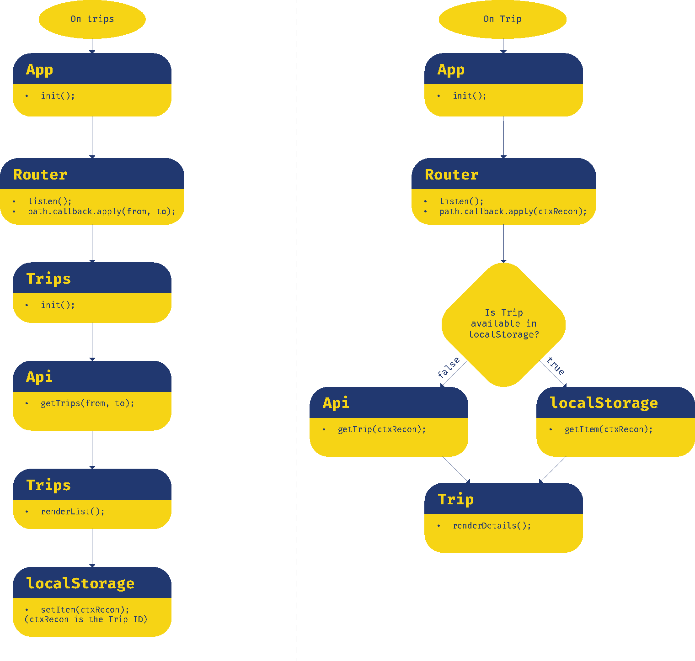

[Live Demo](https://aaraar.github.io/web-app-from-scratch-1920/)
    

# NS tripplanner Readme

## Table of Contents
- [How to install](#how-to-install)
- [App goal](#app-goal)
  * [Checklist](#checklist)
- [Personal Progress](#personal-progress) 
  * [Object Oriented Programming](#oop)
  * [Typescript](#typescript)
  * [Creating own router](#hashrouter)
- [Actor Diagram](#actors-in-app)
  * [Description](#actor-diagram-description)
  * [Diagram](#actor-diagram)
- [Interaction Diagrams](#interaction-diagrams)
  * [Description](#actor-diagram-description)
  * [Diagram](#actor-diagram)
- [API & Limitations](#api--limitations)
  * [Response example](#ns-stations-response-example)

## How to install
### Requirements
- Node.js
- NPM/Yarn
### Steps
- Clone this project
- Open terminal and navigate to the folder
- run `yarn` or `npm install` depending on your package manager prefference
- run `yarn dev` or `npm run dev`
- Open your browser and navigate to 
#### Or simply go to the github.io page of this repo at 
## App goal
The goal of the app is to simplify the flow of finding the right train trip.
A feature that NS (Dutch railway company) provides in their API is to show the crowdedness of each wagon.
My initial goal was to make it easier to choose a seat before entering the train based on that info
*Personal goal: Using 0.0 (npm)packages on the front-end*
### Checklist
- [x] Find your origin station
- [x] Show origin station info
- [x] Find destination station
- [x] Display trips between departure and destination
- [x] View trip details
- [ ] View seat availability
    


## Personal Progress
This project is part of a minor web-development at the AUAS as seen by the fork origin.
For this project my goal was to challenge myself on 3 parts:
- Object Oriented Programming
- Typescript
- Creating my own (hash-)router
### OOP
The prototypal inheritance of JavaScript is one of its major features that make it such an interesting language.
And even though I knew how this worked, I never really experimented with it. Therefore a goal for this project was to create it fully
using classes and inheritance of objects to create a Object Oriented Structure. I had never used the class syntax before so
it was a strong lesson for me on how the scoping and innerworkings of these prototypes work
### Typescript
At my current job we are transitioning into using Typescript for (almost) all projects.
To practice this I want to use it on my own projects as much as possible.
Because of the strict typing of Typescript it is ideal for working with so many unknown data from an API.
I have learnt much about type declarations and workings of Typescript by using it on this project where a lot of promises
and other unknown data types are handled. You can see the type declaration make an appearance in the actor diagram to make it
a lot more readable in my opinion
### (Hash)router
This component of the project, relies heavily on a tutorial from 
I converted it to typescript by declaring all the types and abstracted the Regular expressions a bit so that it accepts express-style paths (express.js).
Therefore I did not completely make this myself, I do however know how and why it works and have made some improvements to it.
It mostly taught me a lot on how to use regular expressions
    
## Actors in app
### Actor Diagram Description
1. Identify the purpose of the app
    - A simple way to check the availablity of seats in an NS-train wagon 
2. Identify the functionalities needed to realize the purpose
    - Users can look for the station they will visit or ar at right now
    - Users can find or plan their trip
    - Users can see the load of each wagon identified by color
    - Users can see alternative trips or trains that reach the same destinations
3. Determine which actors will handle these functionalities
    - Users can enter a search term: App->Stations->filter
    - Users can select a station (departure): App->Stations->Station(->Details)
    - Users select a destination (arrival): App->Stations->Station(->Details)
    - Users can view trip information: App->Trip
### Actor Diagram


## Interaction Diagrams
The diagram below shows a simplified flow of the 4 major application flows
    




## API & limitations
*NS api's*    
Hoewel NS er naar streeft de NS API doorlopend beschikbaar te houden, kan NS dat niet garanderen. 
Ter voorkoming van congestie of overbelasting van het systeem hanteert NS een gebruikslimiet van
1.000 requests per 5 minuten voor de travel information api
en 180 requests per 5 minuten voor de price information api.
Bij overmatig gebruik van de NS API kan NS de toegang tot de NS API beperken of blokkeren.


### NS stations response example
```json
{
"EVACode": "7004428",
"UICCode": "7015400",
"code": "STP",
"heeftFaciliteiten": true,
"heeftReisassistentie": false,
"heeftVertrektijden": true,
"land": "GB",
"lat": 51.531437,
"lng": -0.126136,
"naderenRadius": 1,
"namen": {
"kort": "London StP",
"lang": "London St. Pancras Int.",
"middel": "London St. P Int"
},
"radius": 1,
"sporen": [],
"stationType": "MEGA_STATION",
"synoniemen": []
}
```


<!-- ☝️ replace this description with a description of your own work -->

<!-- replace the code in the /docs folder with your own, so you can showcase your work with GitHub Pages 🌍 -->

<!-- Add a nice poster image here at the end of the week, showing off your shiny frontend 📸 -->

<!-- Maybe a table of contents here? 📚 -->

<!-- How about a section that describes how to install this project? 🤓 -->

<!-- ...but how does one use this project? What are its features 🤔 -->

<!-- What external data source is featured in your project and what are its properties 🌠 -->

<!-- Maybe a checklist of done stuff and stuff still on your wishlist? ✅ -->

<!-- How about a license here? 📜 (or is it a licence?) 🤷 -->
