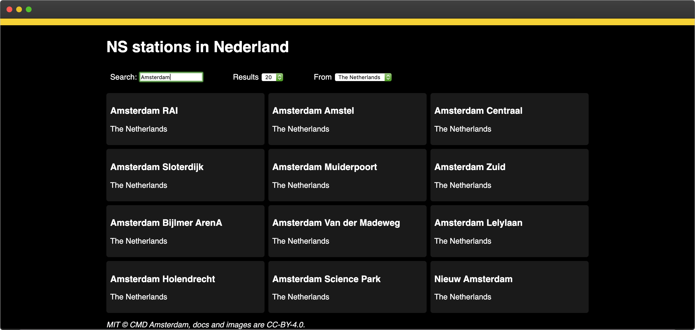
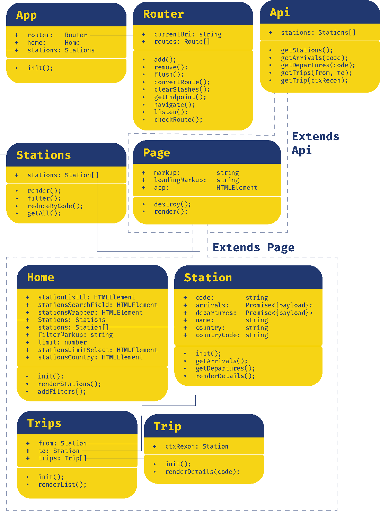
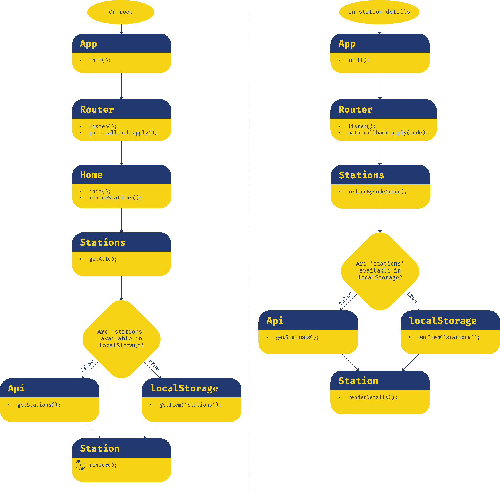

[Live Demo](https://aaraar.github.io/web-app-from-scratch-1920/)
    

 
## App goal
- Display train and trip information from NS
- Planning trips and showing availability of seats in each wagon
    

    
## Actors in app
1. Identify the purpose of the app
    - A simple way to check the availablity of seats in an NS-train wagon 
2. Identify the functionalities needed to realize the purpose
    - Users can look for the station they will visit or ar at right now
    - Users can find or plan their trip
    - Users can see the load of each wagon identified by color
    - Users can see alternative trips or trains that reach the same destinations
3. Determine which actors will handle these functionalities
    - Users can enter a search term: App->Stations->filter
    - Users can select a station (departure): App->Stations->Station(->Details)
    - Users select a destination (arrival): App->Stations->Station(->Details)
    - Users can view trip information: App->Trip




## Interaction
The diagram below shows a simplified flow of the 2 major application flows
    


## API & limitations
*NS api's*    
Hoewel NS er naar streeft de NS API doorlopend beschikbaar te houden, kan NS dat niet garanderen. 
Ter voorkoming van congestie of overbelasting van het systeem hanteert NS een gebruikslimiet van
1.000 requests per 5 minuten voor de travel information api
en 180 requests per 5 minuten voor de price information api.
Bij overmatig gebruik van de NS API kan NS de toegang tot de NS API beperken of blokkeren.

## Design patterns and best practices  
## Deature wishlist / backlog
- Search for a station and it's departing trains from each track
- Search for a trip between two stations
    - Display departure and arrival times
    - Display passing stations in trip
    - Display train occupation per 

### NS stations response example
```json
{
"EVACode": "7004428",
"UICCode": "7015400",
"code": "STP",
"heeftFaciliteiten": true,
"heeftReisassistentie": false,
"heeftVertrektijden": true,
"land": "GB",
"lat": 51.531437,
"lng": -0.126136,
"naderenRadius": 1,
"namen": {
"kort": "London StP",
"lang": "London St. Pancras Int.",
"middel": "London St. P Int"
},
"radius": 1,
"sporen": [],
"stationType": "MEGA_STATION",
"synoniemen": []
}
```


<!-- ☝️ replace this description with a description of your own work -->

<!-- replace the code in the /docs folder with your own, so you can showcase your work with GitHub Pages 🌍 -->

<!-- Add a nice poster image here at the end of the week, showing off your shiny frontend 📸 -->

<!-- Maybe a table of contents here? 📚 -->

<!-- How about a section that describes how to install this project? 🤓 -->

<!-- ...but how does one use this project? What are its features 🤔 -->

<!-- What external data source is featured in your project and what are its properties 🌠 -->

<!-- Maybe a checklist of done stuff and stuff still on your wishlist? ✅ -->

<!-- How about a license here? 📜 (or is it a licence?) 🤷 -->
